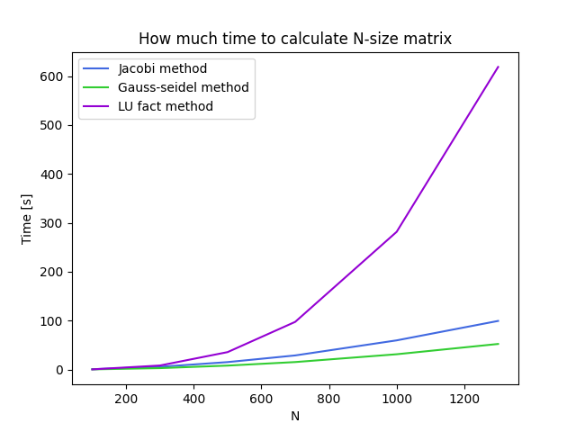

# JacobiGaussLU

Project that generates matrix A and vector B and tries to find X using differnt methods: 
- Jacobi
- Gauss-Seidl
- LU factorization

You can save the chosen matrix by using function write_matrix_to_file()

## Plot

!

## Time in seconds that it takes to solve N equations with an Algorithm

